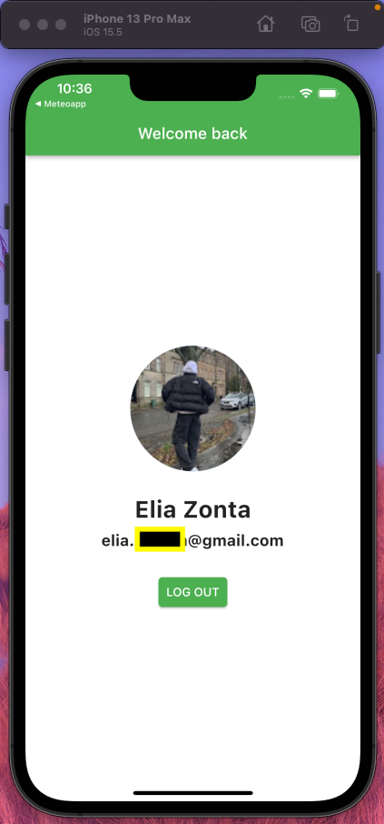

# Google Sign In

Super simple example of integration between a [Flutter](https://flutter.dev) application and [Firebase](https://firebase.google.com) used for Google Authentication

## How to run locally

First clone the repo with

```
git clone https://github.com/eliazonta/google-auth.git

```

then run

```flutter run```

## Preview
First Screenshot           |  Second Screenshot        | Third Screenshot
:-------------------------:|:-------------------------:|:-------------------------:
  |  | 